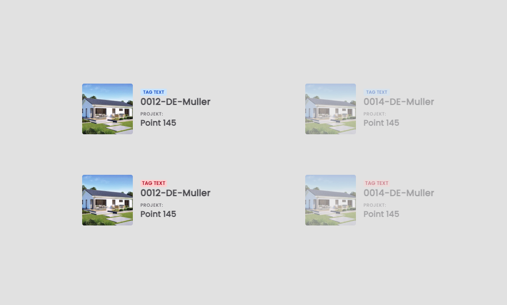
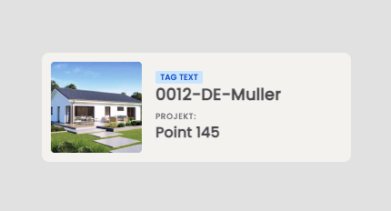
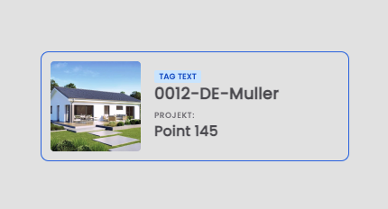
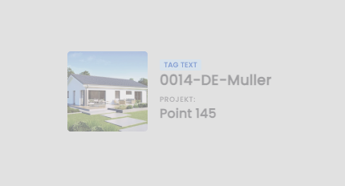
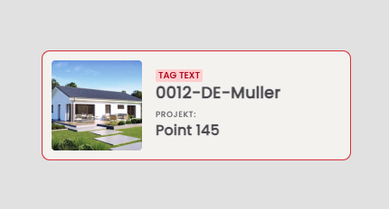

# React Product Card

## :technologist: Technologies and metodologies

Technologies and metodologies used in this project:

**React / SCSS / BEM / RWD / Webpack**

## :gear: Installation

The project uses [node](https://nodejs.org/en/) and [npm](https://www.npmjs.com/). To run the app on your device you should install all dependencies. Then create a localhost port and run your web explorer.

Let's start with installing all dependencies. Move to the app main workspace and run:

    npm i

To create a localhost port you should type:

    npm start

Our repositories search engine is ready at port 8080.

    http://localhost:8080/

## :city_sunset: Product card

This project presents several options for presenting product cards to the customer.

If the product card is enable, we are able to select card and also see the hover effect on it.

#### :point_right: Hover effect

#### :point_right: Select effect

If the product card is disable, there is no possibility to select this card and also to see the hover effect on it.

#### :point_right: Disabled card

#### :red_circle: Error card

It is also possible to set special presets for product cards. In this project, we can set the "error card" by changing boolean properties in JSON file. If we set "isError" property as a "true", then we'll see changed tag and border colors.

